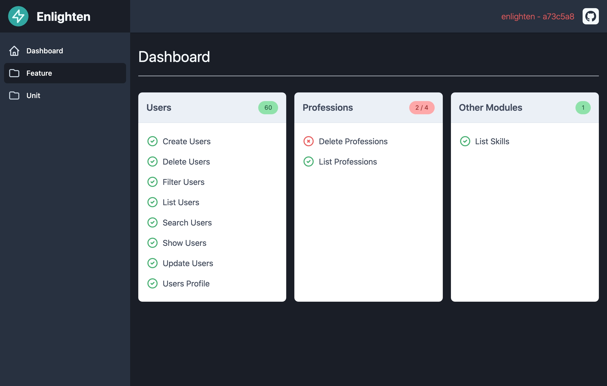

# Laravel Enlighten

[]
[](//packagist.org/packages/phpunit/phpunit) [](//packagist.org/packages/phpunit/phpunit) [](//packagist.org/packages/phpunit/phpunit) [](//packagist.org/packages/phpunit/phpunit)

A seamless package to document your Laravel APIs.

There is no need to add endless docblocks to each API method, maintain dozens of read   me files, or write extensive wikis to keep your APIs documented and in sync with your codebase!

Enlighten your Laravel applications with a beautiful documentation generated automatically from your test suites, by doing so, your documentation will always be updated with the current version of your app.

If you have already invested a lot of time developing and testing your API you don't need to spend the same amount of time documenting it, we'll do that for you, you deserve it!

## Introducing Laravel Enlighten



After installing the component, run `phpunit` and that's it! You'll find the entire API documentation in the following URL: `/enlighten/`

## Usage
After finishing the installation process, run your Laravel tests as usual.

```bash
phpunit
```

Now visit `/enlighten/` to navigate the documentation.

## Installation

1. Require the package with Composer:

```bash
composer require styde/enlighten --dev
```

If you are not using the Laravel package auto-discovery feature, please add the following service-provider to `config/app.php`

```php
[
    'providers' => [
        // ...
        Styde\Enlighten\Providers\EnlightenServiceProvider::class,
    ]
];
```

2. Publish the package assets (CSS, JavaScript) to the public folder using Artisan:

```bash
php artisan vendor:publish --tag=enlighten-build
```

Optionally, you can publish the config file and views for more customization.

```bash
php artisan vendor:publish --tag=enlighten-config
php artisan vendor:publish --tag=enlighten-views
```

3. Import the trait `Styde\Enlighten\Tests\EnlightenSetup` and call `$this->enlightenSetUp()` in the `setUp` method of your `TestCase`, for example:

```
<?php

namespace Tests;

use Styde\Enlighten\Tests\EnlightenSetup;

class TestCase extends \Tests\TestCase
{
    use EnlightenSetup;

    protected function setUp(): void
    {
        parent::setUp();

        $this->setUpEnlighten();
    }
```

*Note:* remember to include and use the trait `Styde\Enlighten\Tests\EnlightenSetup`.

## Database Setup
`Enligthen` uses a secondary database and database connection to record and present the information from your test-suite.

If you use the following convention: 

* A non-sqlite default database for your local enviroment (i.e. `my_db`)
* A non-sqlite database for your test enviroment with the `_test` or `_tests` suffix (i.e. `my_db_tests`) 

Just add a new database using the same name of your default database with the `_enlighten` suffix:

```text
# .env
DB_NAME=my_default_database
# phpunit.xml
# <env name="DB_DATABASE" value="my_default_database_tests"/>
# Enlighten auto configuration:
# my_default_database_enlighten
```

If you're not following the convention above, add a new connection entry in `config/database.php` with the name `enlighten` and your custom configuration:

```
   'enlighten' => [
       'driver' => 'mysql',
       'host' => env('DB_HOST', '127.0.0.1'),
       'port' => env('DB_PORT', '3306'),
       'database' => 'my_enlighten_database',
       // ...
    ],
```

After creating the new database, run the migrations using Artisan:

```bash
php artisan migrate
```

> It's important to create a different connection for Enlighten to avoid having the info deleted or not persisted when
> using any of the database migration traits included by Laravel or if you run the tests using SQLite.

## "See in Enlighten" link

Add the `printerClass` attribute with the value `Styde\Enlighten\Tests\BasicResultPrinter` to the `phpunit` tag in `phpunit.xml` like in the example below. Don't delete the other attributes!

```
<phpunit [...] printerClass="Styde\Enlighten\Tests\BasicResultPrinter">
```

## Optional configuration
To "group" your tests-classes as "modules", you can use a regular expression to find all the classes that match with the given pattern or patterns:

```php
// config/enlighten.php
[
    'modules' => [
        [
            'name' => 'Users',
            'pattern' => ['*Users*']
        ],
        [
            'name' => 'Projects',
            'pattern' => ['*Projects*', '*Project*']
        ],
        [
            'name' => 'Other Modules',
            'pattern' => ['*'],
        ],
    ]
];
```

> You can add a "catch all" group at the end to include all those files that didn't match with any of the other patterns, otherwise Enlighten will do this automatically for you.

## Excluding test-classes from the documentation
If you want to include all the test-classes and methods in your documentation, you can skip this step, otherwise, you can add the following key to the `/config/enlighten.php` file:

```php
[
    'tests' => [
        // Add expressions to ignore test class names and test method names.
        // i.e. Tests\Unit\* ignores all tests in the Tests\Unit\ suite,
        // validates_* ignores all tests that start with validates_.
        'ignore' => [
            'method_that_will_be_ignored',
        ],
    ],
];
```

## Customizing titles and descriptions
If you want to have more control on the titles of the classes and methods, or add descriptions to each group or example, you can add the following annotations in your test classes and methods:

```php
/**
 * @title User Module
 *
 * or if you prefer:
 *
 * @testdox User Module
 *
 *  and you can also use:
 *
 * @description Manage all the user-related petitions.
 **/
class UsersTest extends TestCase {

    /**
     *
     * @testdox Create Users
     *
     * @description Register a new user via POST request. API credentials must be provided.
     **/
    public function testRegisterNewUsers()
    {
        $this->assertTrue(true);
    }
}
```

## Customizing the intro page

To customize the content of your Dashboard page, you can add an `ENLIGHTEN.md` markdown file to the root path of your project.
The content of this file will overwrite the default page provided by this package.

## Credits
- [Duilio Palacios](https://twitter.com/sileence)
- [Jeff Ochoa](https://twitter.com/jeffer_8a)
- [All contributors](https://github.com/StydeNet/enlighten/graphs/contributors)

## License
The MIT License (MIT). Please see [License](https://github.com/styde/enlighten/blob/master/LICENSE.md) File for more information.
